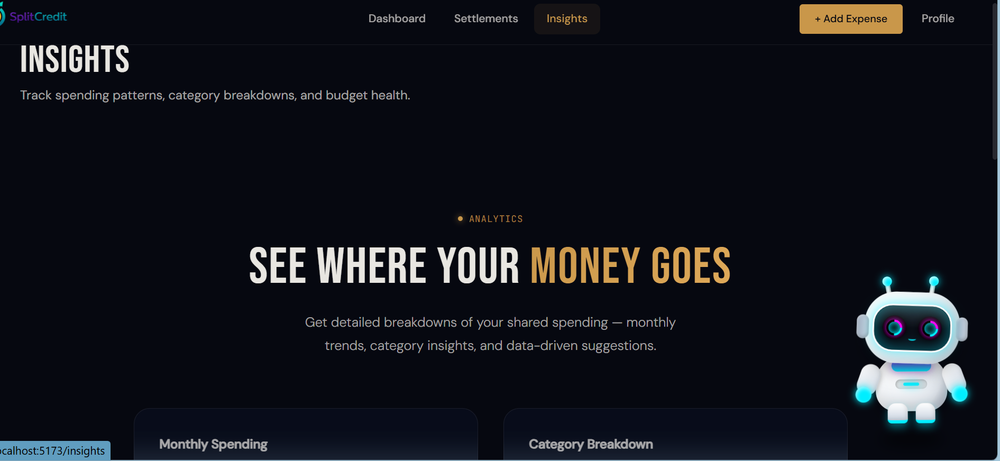
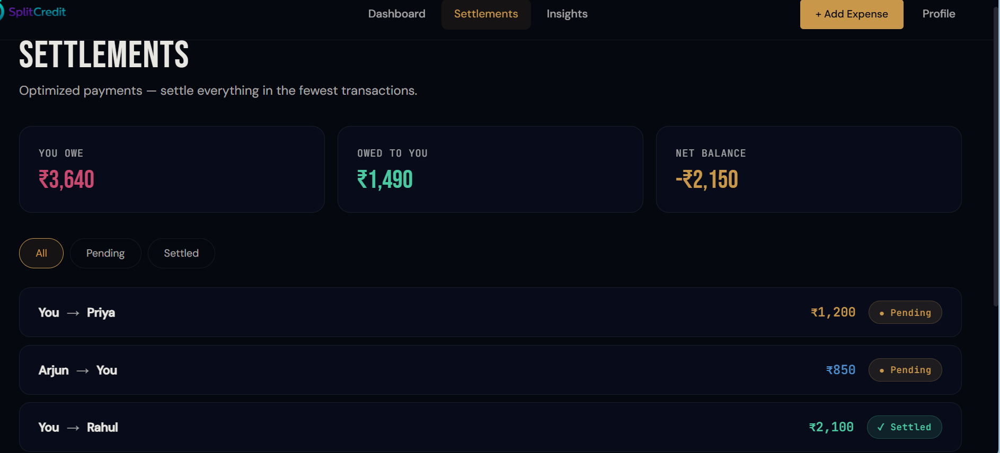
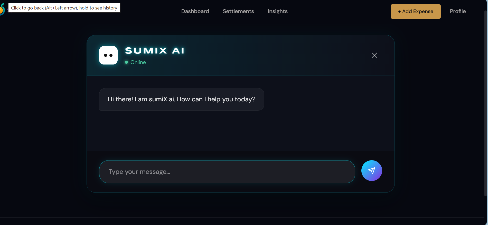

# ⚡ FairSplit

### Next-Gen Expense Splitting Engine with AI-Powered Insights

> **Less Debt. More Trust. Fewer Transactions.**

---

## 🚀 What is FairSplit?

**FairSplit** is a premium fintech web application that redefines how groups manage shared expenses.

Instead of just tracking who owes whom, it uses a **graph-based optimization algorithm** to **minimize the total number of transactions**, making settlements faster, cleaner, and smarter.

💡 *Think Splitwise — but optimized, intelligent, and beautifully designed.*

---

## 🧠 Core Innovation

### 🔹 Smart Settlement Engine

* Implements **Greedy Min-Cash-Flow Algorithm (O(n log n))**
* Reduces redundant payments by up to **70%**
* Resolves complex debt cycles into **minimum transactions**

👉 Example:
Alice → Bob → Carol → becomes → **Alice pays Carol directly**

---

## 🤖 sumiX AI (Your Smart Finance Assistant)

A fully interactive **floating 3D chatbot** built with pure CSS + animations:

* Lives on the **Insights Page**
* Provides **spending insights & financial guidance**
* Features **idle human-like animations (look-around motion)**
* Built without heavy WebGL → **high performance**

---

## 📊 Key Features

* 🧮 **Optimized Settlements** – Minimal transactions, maximum clarity
* 📊 **Spending Insights Dashboard** – Category breakdown & trends
* 🛡️ **Trust Score System** – Gamified reliability tracking
* 🤖 **AI Chatbot (sumiX)** – Context-aware financial assistant
* 🎨 **Premium UI/UX** – Glassmorphism + dark fintech aesthetic
* ⚡ **Smooth Animations** – Framer Motion + GSAP + Lenis

---

## 🛠️ Tech Stack

| Layer      | Technology                                  |
| ---------- | ------------------------------------------- |
| Frontend   | React 19 + Vite                             |
| Styling    | Tailwind CSS 4 + Custom CSS (3D transforms) |
| Animations | Framer Motion, GSAP                         |
| Routing    | React Router (lazy-loaded)                  |
| State      | Context API                                 |
| AI Backend | Node.js + OpenAI API                        |

---

## 📸 Preview
## 📸 Preview

### 🖥️ Dashboard


### 📊 Insights Page


### 💳 Settlement Page


### 🤖 Chatbot Interaction



---

## ⚡ Performance Highlights

* 🚀 Lazy-loaded routes → faster initial load
* 🎯 Optimized rendering with modular components
* 🧠 Algorithm-driven backend logic
* 🎨 GPU-efficient CSS 3D instead of heavy canvas

---

## 💻 Run Locally

```bash
git clone https://github.com/yourusername/fairsplit.git
cd fairsplit/frontend
npm install
npm run dev
```

👉 Open: http://localhost:5173

---

## 🧠 Why This Project Stands Out

* Goes beyond CRUD → includes **algorithmic optimization**
* Combines **AI + Fintech + UI Engineering**
* Demonstrates **real-world scalability thinking**
* Focus on **both performance + experience**

---

## 👨‍💻 Developers

**Soumya Sharma**
**Mritunjay Mohanty**

---


